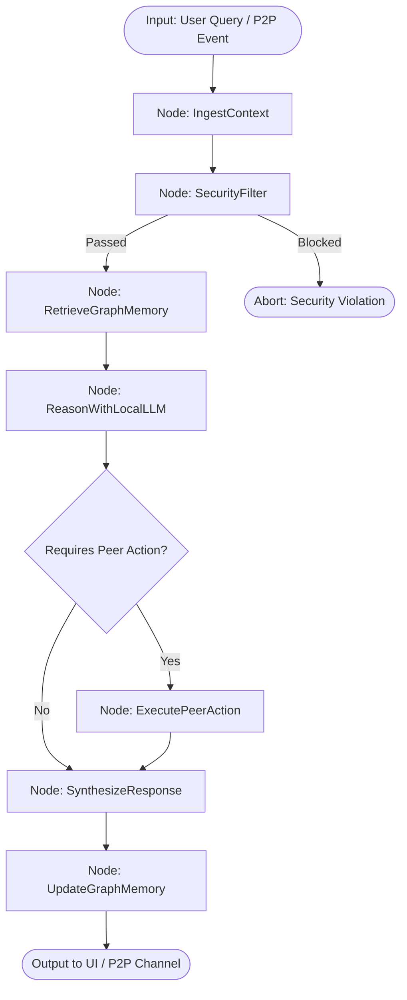

# WhisperMesh — Product Requirements Document (PRD)

## Document Details
- **Product Name:** WhisperMesh (STeHat)
- **Document Version:** 1.1.0
- **Status:** Active / Engineering Execution
- **Product Type:** Cross-Platform, Privacy-Focused, Low-Latency Peer-to-Peer Presence, Chat & Edge AI Agent Application
- **Core Technology Stack:** Rust, Tauri 2, Swift, TypeScript, LangChain & LangGraph

---

## 1. Product Overview
WhisperMesh is a cross-platform, privacy-focused, low-latency peer-to-peer (P2P) presence, messaging, and agentic intelligence application targeting macOS, Windows, and iOS. The product enables geographically dispersed users across distinct networks, ISPs, and devices to discover each other within an ephemeral global presence space, initiate mutual connection requests, verify identity through short-lived numeric pairing codes, conduct secure end-to-end encrypted realtime text messaging via WebRTC DataChannels with automated TURN relay fallback, and leverage an on-device edge AI agent (LangChain & LangGraph) that reasons locally with zero cloud data leaks.

---

## 2. Problem Statement
Contemporary messaging and AI platforms predominantly rely on centralized message-routing architectures where plaintext, metadata, and messaging graphs traverse and persist on third-party servers. Furthermore:
1. **Network Discovery Barriers:** Many local-first or P2P tools rely strictly on Local Area Network (LAN) discovery (e.g., mDNS, Bonjour), preventing cross-network communication between users across heterogeneous cellular and broadband networks.
2. **Centralized AI Privacy Leaks:** Cloud AI chatbots ingest private conversations into central model training pipelines, violating enterprise and personal zero-trust policies.
3. **Complex Onboarding and Identity Burdens:** Users are forced into phone number verification, centralized email accounts, or cumbersome cryptographic key exchanges.
4. **NAT and Firewall Traversal Failures:** Direct P2P networks fail completely under Symmetric NATs or strict carrier-grade NAT (CGNAT) without managed relay traversal.
5. **Heavy Resource Footprints:** Existing cross-platform desktop and mobile clients frequently bundle heavyweight web runtimes with high memory overhead and sluggish responsiveness.

WhisperMesh resolves these challenges through a three-layer architecture:
- **Rust Core & Tauri 2:** Maximum speed, minimal memory footprint, and native OS security for desktop.
- **Swift & SwiftUI:** Native Apple platform performance, iOS Keychain integration, and Neural Engine acceleration.
- **LangGraph Edge Intelligence:** Autonomous, cyclic reasoning and local graph indexing that runs strictly on the client device.

---

## 3. Product Vision
Deliver a universally accessible, lightweight, and zero-trust communication and intelligence tool where any two users in the world can instantly discover one another, establish cryptographic trust in seconds through human-verifiable pairing codes, communicate with minimum latency, zero server-side message persistence, complete network independence, and leverage a private, local agent that reasons without exposing data to the cloud.

---

## 4. Goals
- **Universal Cross-Network Reachability:** Connect users across disparate ISPs, mobile carrier networks, Wi-Fi setups, and corporate/home NATs worldwide without requiring a shared local network.
- **Native Multi-Language Stack:** Utilize Rust for native systems programming, cryptography, and Tauri 2 backend; Swift for native iOS and macOS system integrations; and TypeScript for shared wire protocol schemas, UI state, and LangGraph workflows.
- **Zero-Knowledge Core Messaging:** Guarantee that server infrastructure never sees, intercepts, or stores plaintext chat messages or private cryptographic keys.
- **Local Edge AI Agent (LangChain + LangGraph):** Embed a local reasoning engine capable of querying local graph memory, sanitizing context, and executing peer actions autonomously with zero server leakage.
- **Low Latency Communication:** Ensure interactive sub-second messaging delivery using WebRTC DataChannel P2P transports.
- **Low Operational Overhead:** Maintain minimal server-side resource footprints using ephemeral Redis data structures, lightweight Fastify signaling, and strict prioritization of direct P2P data flow to minimize TURN bandwidth costs.
- **Frictionless Verification:** Provide single-use, rate-limited, short-lived pairing-code verification that prevents man-in-the-middle (MITM) attacks without requiring out-of-band key gymnastics.

---

## 5. Non-Goals
- **No Cloud LLM Ingestion of Raw Chats:** Central servers will never run LLMs that process unencrypted peer chats or store context embeddings centrally.
- **No Permanent Message Storage on Servers:** The central infrastructure will not persist, buffer, or archive chat transcripts under any circumstances.
- **No Social Graph or Public Profiles:** No user directories, contact address books, persistent follower lists, public profiles, avatars, or discovery algorithms.
- **No Algorithmic Discovery or Feed Mechanics:** No recommendations, matchmaking, user search queries beyond explicit active presence, or algorithmic ranking.
- **No Voice or Video Calling in MVP:** MVP is strictly constrained to bidirectional text messaging and connection lifecycle primitives.
- **No Group Chat in MVP:** Multi-peer mesh or SFU-based group communications are strictly excluded from the initial release; all sessions are point-to-point (1-to-1).
- **No Analytics / Telemetry Snooping:** No third-party behavioral analytics, ad-tracking SDKs, or invasive device telemetry.

---

## 6. Target Users
- **Privacy-Sensitive Collaborators:** Users requiring immediate, zero-trace, transient communication channels free from centralized corporate logging and data-at-rest subpoena risks.
- **Remote Technical Teams & Operators:** Engineers and systems administrators operating across varying network topologies needing rapid, direct peer-to-peer verification and messaging.
- **Knowledge Workers Requiring Local AI:** Users who need intelligent context synthesis, local graph memory, and automated workflows without sending confidential data to centralized cloud AI vendors.

---

## 7. User Stories
- **US-01:** As a new user, I want to download and open the app on macOS, Windows, or iOS and set an ephemeral display name without providing an email, phone number, or password.
- **US-02:** As an active user, I want the system to automatically generate a cryptographic identity bound to my device via native Rust/Swift secure enclaves so my security keys remain local and secure.
- **US-03:** As an active user, I want to see a live list of other available users globally, including their display name, platform, and availability state, regardless of their network or geographic location.
- **US-04:** As an active user, I want to select an available peer and send a connection request so that we can begin a private communication session.
- **US-05:** As a recipient, I want to receive an incoming connection notification with the sender's display name and device platform, with the option to accept or reject the request.
- **US-06:** As both initiating and receiving peers, I want to see a matching short-lived numeric pairing code upon request acceptance so that we can verify and authenticate each other before opening a data channel.
- **US-07:** As a connected user, I want my messages to travel directly peer-to-peer via WebRTC DataChannels with minimum latency, falling back to an encrypted TURN relay automatically if our network firewalls block direct connection.
- **US-08:** As a connected user, I want to see real-time delivery state indicators for messages sent during the active session.
- **US-09:** As an intermittent user, I want the application to automatically transition my presence to offline when I lose network connectivity, and seamlessly recover my connection state upon network restoration.
- **US-10:** As a privacy-conscious user, I want all active session messages wiped when I close the session or terminate the application.
- **US-11:** As an edge AI user, I want a local LangGraph agent to extract context from my active session, query my local graph index, and summarize insights locally without transmitting any data over the internet.

---

## 8. Core User & Agent Flows

```
[Available User]
       │
       ▼
[Initiate Connection Request]
       │
       ▼
[Recipient Prompts Accept / Reject]
  ├── (Reject) ──► [Notify Initiator: Rejected] ──► [End Session]
  └── (Accept) ──► [Generate Ephemeral Pairing Session & Numeric Code]
                         │
                         ▼
             [Pairing Code Verification]
                         │
                         ▼
             [Cryptographic Key Exchange / Auth (Rust/Swift)]
                         │
                         ▼
             [WebRTC Signaling (Offer / Answer / ICE)]
                         │
          ┌──────────────┴──────────────┐
          ▼                             ▼
  [Direct P2P DataChannel]     [Fallback to TURN Relay]
          │                             │
          └──────────────┬──────────────┘
                         ▼
              [Active Encrypted Chat]
                         │
                         ▼
              [LangGraph Edge Agent Engine]
           (Local Graph Memory + Privacy Filter)
```

---

## 9. Functional Requirements

### 9.1 Identity and Onboarding
- **FR-01:** System must allow the user to set and locally update an alphanumeric display name (1–32 characters) without central authentication credentials.
- **FR-02:** System must generate an asymmetric cryptographic key pair directly on the client during first launch:
  - Ed25519 for identity signing and verification (via native Rust `ed25519-dalek` on Desktop, Swift `CryptoKit` on iOS).
  - X25519 for Diffie-Hellman key agreement.
- **FR-03:** Client must generate a persistent UUIDv4 Device ID upon initial installation.
- **FR-04:** Private keys must never leave the client device under any condition.
- **FR-05:** System must detect and report the host operating system platform (`macOS`, `Windows`, `iOS`, `Android`) and hardware form factor.

### 9.2 Global Presence Management
- **FR-06:** Client must establish an encrypted WebSocket connection (`wss://`) to the presence server upon application launch.
- **FR-07:** Presence service must maintain ephemeral device records containing: `device_id`, `display_name`, `platform`, `public_key`, `status`, and `last_seen_timestamp`.
- **FR-08:** System must support four discrete presence states: `Available`, `Connecting`, `Connected`, and `Offline`.
- **FR-09:** Client must transmit heartbeats (`PING`) at fixed 15-second intervals.
- **FR-10:** Server must evict client records and mark the device `Offline` if no heartbeat or activity is received within a 30-second window.
- **FR-11:** Server must broadcast incremental presence updates (`PRESENCE_UPDATE`, `PRESENCE_OFFLINE`) to all connected clients.
- **FR-12:** Client must automatically attempt WebSocket reconnection with exponential backoff upon network interruption.

### 9.3 Connection Requests, Verification and Pairing
- **FR-13:** An `Available` user must be able to send a targeted `CONNECTION_REQUEST` to any other `Available` user.
- **FR-14:** Recipient must receive real-time request alerts displaying sender's name and platform with explicit `Accept` and `Reject` actions.
- **FR-15:** Upon acceptance, server generates a random 6-digit numeric pairing code with a strict 60-second TTL.
- **FR-16:** Both clients render the code on-screen. Users confirm verification via UI action.
- **FR-17:** Maximum 3 failed verification attempts permitted per session before automatic invalidation.
- **FR-18:** Clients verify mutual Ed25519 signatures of the pairing session challenge prior to signaling authorization.

### 9.4 WebRTC Signaling & Encrypted Messaging
- **FR-19:** Server routes SDP Offers, SDP Answers, and ICE Candidates strictly between mutually verified pairs.
- **FR-20:** System queries STUN for direct hole punching and provisions short-lived coturn TURN credentials if direct connection fails.
- **FR-21:** DataChannel establishes an SCTP channel (`whispermesh-data`) with reliable, ordered delivery.
- **FR-22:** Wire messages are serialized via MessagePack and signed with the sender's Ed25519 key.

### 9.5 LangGraph & Edge AI Engine
- **FR-23:** Client must embed a local LangGraph `StateGraph` agent capable of cyclic reasoning, context retrieval, and decision-making.
- **FR-24:** Agent engine must integrate a local graph memory index (vector embeddings + relational node links) maintained on device.
- **FR-25:** System must enforce a strict `SecurityFilter` node that intercepts prompts to prevent private keys or network credentials from entering model context.
- **FR-26:** Agent must support local inference drivers: Apple MLX on Apple Silicon macOS/iOS, Llama.cpp / Ollama on desktop platforms.
- **FR-27:** Agent must have tool bindings allowing it to request peer status, inspect local chat summaries, and format outgoing structured messages.

---

## 10. Multi-Language System Architecture

```
                    ┌────────────────────────────────────────────────────────┐
                    │                    WhisperMesh Cloud                   │
                    │                                                        │
                    │   ┌─────────────────────┐   ┌──────────────────────┐   │
                    │   │ Fastify Backend     │   │ coturn Infrastructure│   │
                    │   │ Signaling & Presence│   │ STUN / TURN Relay    │   │
                    │   │ (Node.js/TypeScript)│   │ (RFC 5389 / 5766)    │   │
                    │   └──────────┬──────────┘   └──────────┬───────────┘   │
                    │              │                         │               │
                    │   ┌──────────┴──────────┐              │               │
                    │   │ Redis (Ephemeral)   │              │               │
                    │   │ + Postgres (Meta)   │              │               │
                    │   └─────────────────────┘              │               │
                    └──────────────┼─────────────────────────┼───────────────┘
                                   │ WSS                     │
            ┌──────────────────────┴──────┐                  │ UDP / TCP
            │                             │                  │ (Fallback)
            ▼                             ▼                  │
 ┌──────────────────────┐      ┌──────────────────────┐      │
 │ Desktop (macOS/Win)  │      │   Mobile (iOS/macOS) │      │
 │ Tauri 2 + Rust Core  │      │ Swift Native / Native│◄─────┘
 │ React 19 UI (TS)     │      │ SwiftUI + CryptoKit  │
 │ LangGraph Agent (TS) │      │ LangGraph Agent (TS) │
 └──────────┬───────────┘      └──────────┬───────────┘
            │                             │
            └──────── WebRTC P2P ─────────┘
                 (DataChannel - Direct)
```

### 10.1 Language & Component Allocation
1. **Rust (Systems & Core Engine):**
   - Tauri 2 backend integration.
   - Audited cryptographic primitives (`ed25519-dalek`, `x25519-dalek`, `hkdf`).
   - Secure OS credential integration (Windows Credential Manager / DPAPI, macOS Keychain).
   - High-throughput binary wire protocol codec (MessagePack / rmp-serde).
2. **Swift (Native Apple Platform Core):**
   - Native iOS application shell with SwiftUI.
   - Direct integration with Apple Silicon Neural Engine (ANE) via MLX Swift / CoreML.
   - Hardware-bound iOS Keychain access (`kSecAttrAccessibleAfterFirstUnlockThisDeviceOnly`).
   - Native WebRTC lifecycle handling during iOS background/foreground transitions.
3. **TypeScript / JavaScript (UI & Agent Orchestration):**
   - Desktop presentation layer: React 19, Tailwind CSS, Lucide icons.
   - Shared protocol schemas and type contracts across client and server.
   - LangChain & LangGraph agent state machines and graph indexing workflows.
   - Fastify WebSocket signaling and presence gateway.

---

## 11. LangGraph StateGraph Architecture



### 11.1 State Schema
```typescript
interface AgentState {
  sessionId: string;
  query: string;
  contextHistory: Array<{ role: 'user' | 'assistant' | 'peer'; content: string }>;
  graphMemoryContext: string[];
  sanitized: boolean;
  peerActionRequired: boolean;
  targetPeerId?: string;
  synthesizedResponse: string;
  executionLog: string[];
}
```

---

## 12. Hardware & Platform Matrix

| Platform | Tier | Language / Runtime | Security Storage | AI Inference Acceleration |
| :--- | :--- | :--- | :--- | :--- |
| **macOS** | Tier 1 | Rust + Tauri 2 + Swift | macOS Keychain | Apple Silicon MLX / Metal GPU |
| **iOS** | Tier 1 | Swift 6 + SwiftUI | iOS Keychain | Apple Neural Engine (ANE) / CoreML |
| **Windows** | Tier 2 | Rust + Tauri 2 | Windows DPAPI | ONNX / DirectML / CPU / CUDA |
| **Android** | Tier 2 | Kotlin + React Native | Android Keystore | NNAPI / Qualcomm NPU |

---

## 13. Infrastructure & Deployment
- **Fastify Signaling Server:** Stateless Node.js / TypeScript gateway with `@fastify/websocket`.
- **Redis Cluster:** Sub-millisecond ephemeral presence and pub/sub routing.
- **coturn Relay:** High-bandwidth STUN/TURN fallback server.
- **Docker Compose:** Complete reproducible local stack in `infrastructure/docker-compose.yml`.

---

## 14. Acceptance Criteria & Verification
- [ ] Client compiles cleanly: Rust/Tauri for desktop, Swift/SwiftUI for iOS.
- [ ] Cryptographic keys generate locally without server interaction; private keys confirmed absent from network traces.
- [ ] Ephemeral presence reflects Available, Connecting, Connected, and Offline across distinct networks within ≤ 500 ms.
- [ ] Mutual 6-digit pairing code verification successfully authenticates peers before signaling.
- [ ] WebRTC DataChannel establishes direct P2P connection, falling back to TURN when firewall restricts direct hole punching.
- [ ] In-memory chat transcripts completely purge on disconnect.
- [ ] LangGraph StateGraph executes locally on-device, successfully answering context queries and executing peer actions with zero cloud data transmission.
