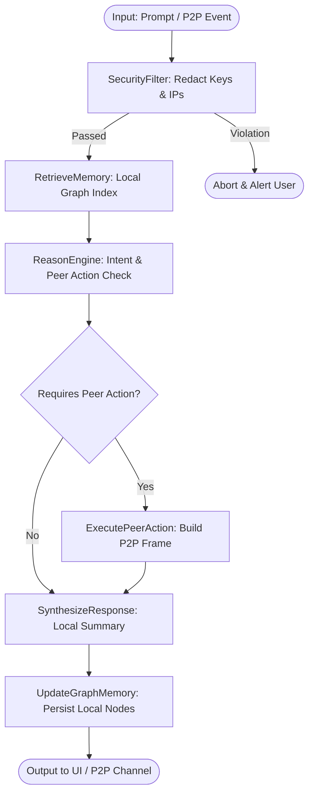

<div align="center">

# ⚡ WhisperMesh (STeHat)

### Cross-Platform, Low-Latency P2P Presence, End-to-End Encrypted Chat & Edge AI Agent

[](LICENSE)
[](https://github.com/Atofinite5/STeHat/tree/dev)
[](https://www.typescriptlang.org/)
[](https://www.rust-lang.org/)
[](https://developer.apple.com/swift/)
[](https://tauri.app/)
[](https://langchain-ai.github.io/langgraph/)

<p align="center">
  <b>Zero Cloud Data Ingestion</b> • <b>Hardware Secure Enclave Keys</b> • <b>Ephemeral Redis Presence</b> • <b>Direct WebRTC DataChannels</b> • <b>coturn Fallback</b> • <b>On-Device Edge Agent</b>
</p>

---

</div>

## 📖 Overview

**WhisperMesh** enables users anywhere in the world—across disparate ISPs, mobile carrier networks, Wi-Fi setups, and NAT environments—to discover one another through an ephemeral global presence space, verify mutual identity via single-use 6-digit numeric pairing codes, and communicate in real time over end-to-end encrypted WebRTC DataChannels with **zero server message persistence**.

WhisperMesh embeds a local, on-device autonomous **AI Agent powered by LangChain & LangGraph**. The agent reasons over a local graph memory index and executes peer actions while strictly ensuring private cryptographic keys and confidential conversation text never leak to third-party cloud LLM providers.

---

## 🏛️ Multi-Language Architecture & Division of Labor

```
                                  ┌─────────────────────────────────────────┐
                                  │           WhisperMesh Gateway           │
                                  │      (Fastify + Redis Ephemeral)        │
                                  └────────────────────┬────────────────────┘
                                                       │ WSS Signaling
                          ┌────────────────────────────┴────────────────────────────┐
                          ▼                                                         ▼
         ┌─────────────────────────────────┐                       ┌─────────────────────────────────┐
         │     Desktop Client (macOS/Win)  │                       │      Native Apple Client (iOS)  │
         │  Tauri 2 + Rust Core + React 19 │                       │       Swift 6 + SwiftUI Core    │
         │   • ed25519-dalek & zeroize     │                       │     • CryptoKit Curve25519      │
         │   • Local LangGraph Agent       │      WebRTC P2P       │     • Apple Silicon ANE / MLX   │
         │   • OS Keychain / DPAPI Storage │◄─────────────────────►│     • Hardware-bound Keychain   │
         └─────────────────────────────────┘ (coturn STUN/TURN Rly)└─────────────────────────────────┘
```

| Component | Language / Framework | Core Responsibilities |
| :--- | :--- | :--- |
| **Protocol** | TypeScript 5.8 (Strict) | Binary MessagePack serializer/deserializer, magic byte `0x57` validation, canonical signature payloads, wire opcodes. |
| **Desktop Core** | Rust (2021) | Hardware-entropy key generation (`ed25519-dalek`, `OsRng`), OS Keychain / DPAPI secure credential storage, memory zeroization (`zeroize`). |
| **Desktop Shell** | Tauri 2 + React 19 | High-performance, lightweight (<90 MB RAM) native desktop application, real-time presence indicators, chat UX. |
| **iOS Core** | Swift 6 + SwiftUI | Native Apple hardware integration, `CryptoKit` Curve25519 signatures, Apple Silicon Neural Engine (ANE) acceleration. |
| **Signaling Server** | Fastify + Redis | Ephemeral presence registry (15s heartbeats, 30s TTL eviction), 6-digit pairing code CSPRNG verifier, WebRTC SDP/ICE router. |
| **Edge AI Engine** | LangChain + LangGraph | Local cyclic `StateGraph` agent, on-device semantic memory index (`LocalGraphIndex`), and strict privacy guardrail node (`SecurityFilter`). |
| **Infrastructure** | Docker (Redis + coturn) | Ephemeral in-memory presence and RFC 5766 STUN/TURN relay for Symmetric NAT firewall traversal. |

---

## 🧠 LangGraph Edge AI Workflow (`StateGraph`)

The embedded agent operates cyclically and completely offline:



- **`SecurityFilter`**: Intercepts prompts to ensure Ed25519 private keys, high-entropy tokens, or internal IP addresses are redacted before inference.
- **`LocalGraphIndex`**: Maintains an on-device semantic knowledge graph without syncing to any central cloud database.

---

## 📂 Monorepo Structure

```
stehat/
├── PRD.md                         # Product Requirements Document (36 Sections)
├── EXECUTION_PLAN.md              # 6-Milestone Engineering Roadmap
├── PROJECT_LOG.md                 # Real-time Changelog & Quality Status
├── README.md                      # Project Overview & Quickstart Guide
├── pnpm-workspace.yaml            # Monorepo Workspace Configuration
├── tsconfig.base.json             # Root TypeScript 5.8 Strict Compiler Options
├── packages/
│   ├── protocol/                  # Shared Wire Protocol & Codecs
│   │   ├── src/codec.ts           # MessagePack Binary Encoder/Decoder
│   │   ├── src/opcodes.ts         # Wire Opcodes & Frame Headers
│   │   ├── src/crypto.ts          # Canonical Challenge Serializer
│   │   └── src/tests/codec.test.ts # 100% Pass Protocol Test Suite
│   ├── server/                    # Ephemeral Presence & Signaling Gateway
│   │   ├── src/gateway/gateway.ts # WebSocket Client Connection Router
│   │   ├── src/presence/presence.ts # Redis-backed 30s TTL Presence Engine
│   │   ├── src/pairing/pairing.ts # 6-Digit CSPRNG Pairing Code Engine
│   │   └── src/index.ts           # Fastify Server Entrypoint
│   ├── agent/                     # Local LangGraph & LangChain Edge Engine
│   │   ├── src/graph/workflow.ts  # Cyclic StateGraph Workflow Definition
│   │   ├── src/security/filter.ts # Privacy & Key Leak Prevention Guardrail
│   │   ├── src/memory/memory.ts   # Local Semantic Graph Memory Index
│   │   └── src/tests/agent.test.ts # 100% Pass Agent Test Suite
│   ├── desktop/                   # Desktop Client (Tauri 2 + Rust + React)
│   │   └── src-tauri/             # Rust Native Core
│   │       ├── src/crypto.rs      # Ed25519 Hardware Identity & Signing
│   │       ├── src/lib.rs         # Shared Rust Library
│   │       └── src/main.rs        # Rust Engine Binary & IPC
│   └── ios/                       # Native Apple Platform Client (Swift 6)
│       ├── Package.swift          # Swift Package Manager Configuration
│       ├── Sources/Core/          # Swift CryptoKit Curve25519 Module
│       └── Sources/Runner/        # Standalone Native Verification Runner
└── infrastructure/
    ├── docker-compose.yml         # Local Redis & coturn Container Stack
    └── coturn/turnserver.conf     # RFC 5766 STUN/TURN Configuration
```

---

## 🚀 Quickstart & Development

### Prerequisites
- **Node.js**: v20+ (tested on v24.10.0) & **pnpm**: v9+ (tested on v10.22.0)
- **Rust**: 1.80+ (tested on rustc 1.95.0) & **Cargo**
- **Swift**: 6.0+ (tested on Swift 6.4)
- **Docker**: For local Redis and coturn containers

### 1. Installation
```bash
# Clone the repository
git clone https://github.com/Atofinite5/STeHat.git
cd STeHat

# Install dependencies across all packages
pnpm install
```

### 2. Run Test Suites & Quality Verification
```bash
# Build all packages (TypeScript strict mode)
pnpm run build

# Run unit tests (Protocol, Agent, LangGraph)
pnpm run test

# Run Rust cryptographic test suite
cd packages/desktop/src-tauri && cargo test && cd ../../..

# Run Swift 6 native CryptoKit runner
cd packages/ios && swift run whispermesh-swift-runner && cd ../..
```

### 3. Start Local Infrastructure
```bash
# Launch ephemeral Redis and coturn STUN/TURN servers
docker compose -f infrastructure/docker-compose.yml up -d
```

### 4. Start Signaling Gateway
```bash
# Start Fastify signaling server in watch mode (Port 4000)
pnpm dev:server
```

---

## 🌿 Git Branching Strategy & Governance

The repository adheres to a strict 3-tier promotion hierarchy:

- **`main` (Production):** Tagged production releases only. No direct pushes. Merges arrive exclusively from `staging`.
- **`staging` (Pre-Release / Integration):** Release candidate branch used for cross-network E2E NAT traversal tests.
- **`dev` (Active Development Trunk):** Daily trunk where all feature modules, tests, and builds land.

---

## 📚 Documentation Links

- **[Product Requirements Document (PRD)](PRD.md):** Complete 36-section technical specifications, privacy guarantees, and invariants.
- **[Engineering Execution Plan](EXECUTION_PLAN.md):** 6-milestone Work Breakdown Structure and task roadmaps.
- **[Project Log & Status Board](PROJECT_LOG.md):** Live sprint log and milestone verification tracking.

---

## 📄 License
Licensed under the [MIT License](LICENSE).
